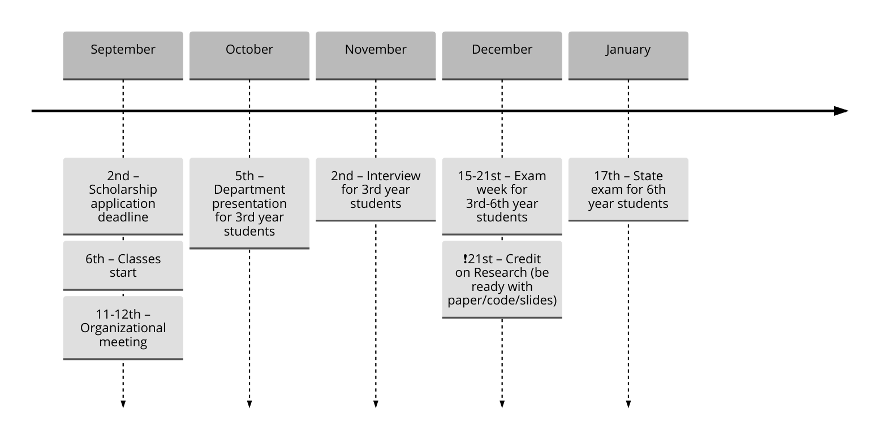

## Schedule

This page contains the schedule for courses offered by the Intelligent Systems Department at MIPT, including key dates, course details, instructors, and assessment types for both bachelor's and master's programs.

**Online Classes:**

- Bachelor's: [m1p.org/go_zoom](https://m1p.org/go_zoom)
- Master's: [m1p.org/go_zoom2](https://m1p.org/go_zoom2)
- YouTube: [youtube.com/@MachineLearningPhystech](https://www.youtube.com/@MachineLearningPhystech)

**Documents and Links:**

- Institute Schedule: [link](https://mipt.ru/upload/%D0%A3%D1%87%D0%B5%D0%B1%D0%BD%D0%BE%D0%B5%20%D1%83%D0%BF%D1%80%D0%B0%D0%B2%D0%BB%D0%B5%D0%BD%D0%B8%D0%B5/%D0%A0%D0%B0%D1%81%D0%BF%D0%B8%D1%81%D0%B0%D0%BD%D0%B8%D0%B5%20%D1%81%D0%B5%D1%81%D1%81%D0%B8%D0%B8/%D0%9B%D0%95%D0%A2%D0%9E%202023-2024/%D0%93%D1%80%D0%B0%D1%84%D0%B8%D0%BA%20%D1%83%D1%87%D0%B5%D0%B1%D0%BD%D0%BE%D0%B3%D0%BE%20%D0%BF%D1%80%D0%BE%D1%86%D0%B5%D1%81%D1%81%D0%B0%20%D0%BD%D0%B0%20%D1%81%D0%B0%D0%B9%D1%82.docx.pdf)
- Research Report Template: [link](https://docs.google.com/document/d/1XsYWC7isbiums9jqjzddHIkDjvxqKNvf/edit?usp=sharing)
- State Exam Program for 6th Year: [link](https://docs.google.com/document/d/1KkePnIg2BOf_LHBLBbgRL0W4gqKtt1W0OhJSg43lR_Y/edit?usp=sharing)

### Fall 2025

#### 4th year, 7th semester - Tuesday

|    Time     | Subject                                                                           | Instructors                                                                                                                                                                                                                                                                         |    Assessment Type    | Credits |
| :---------: | --------------------------------------------------------------------------------- | ----------------------------------------------------------------------------------------------------------------------------------------------------------------------------------------------------------------------------------------------------------------------------------- | :-------------------: | :-----: |
| 10:30-12:00 | [Deep Learning: Lecture]({{ site.baseurl }}/course/deep_learning)                 | [Eduard Vladimirov]({{ site.baseurl }}/people/vladimirov_ea), [Daniil Dorin]({{ site.baseurl }}/people/dorin_dd), [Nikita Kiselev]({{ site.baseurl }}/people/kiselev_ns), [Sergey Firsov]({{ site.baseurl }}/people/firsov_sa), [Vadim Kasiuk]({{ site.baseurl }}/people/kasiuk_va) | Differentiated credit |    2    |
| 12:10-13:40 | [Deep Learning: Seminar]({{ site.baseurl }}/course/deep_learning)                 | [Eduard Vladimirov]({{ site.baseurl }}/people/vladimirov_ea), [Daniil Dorin]({{ site.baseurl }}/people/dorin_dd), [Nikita Kiselev]({{ site.baseurl }}/people/kiselev_ns), [Sergey Firsov]({{ site.baseurl }}/people/firsov_sa), [Vadim Kasiuk]({{ site.baseurl }}/people/kasiuk_va) |                       |         |
| 14:30-16:00 | [Bayesian Model Selection]({{ site.baseurl }}/course/bayesian_model_selection)    | [Alexander Aduenko]({{ site.baseurl }}/people/aduenko_aa), [Konstantin Yakovlev]({{ site.baseurl }}/people/yakovlev_kd)                                                                                                                                                             | Differentiated credit |    1    |
| 16:10-17:40 | [Mathematical Forecasting Methods]({{ site.baseurl }}/course/forecasting_methods) | [Denis Tikhonov]({{ site.baseurl }}/people/tikhonov_dm), [Sviatoslav Panchenko]({{ site.baseurl }}/people/panchenko_sk)                                                                                                                                                             | Differentiated credit |    1    |

#### 5th year, 9th semester - Tuesday

|    Time     | Subject                                                                             | Instructors                                                                                                       |    Assessment Type    | Credits |
| :---------: | ----------------------------------------------------------------------------------- | ----------------------------------------------------------------------------------------------------------------- | :-------------------: | :-----: |
| 14:30-16:00 | [Bayesian Multimodeling]({{ site.baseurl }}/course/bayesian_multimodeling)          | [Oleg Bakhteev]({{ site.baseurl }}/people/bakhteev_oy)                                                            | Differentiated credit |    2    |
| 16:10-17:40 | [Creation of Intelligent Systems]({{ site.baseurl }}/course/rnd_in_ai)              | [Andrey Grabovoy]({{ site.baseurl }}/people/grabovoy_av)                                                          | Differentiated credit |    2    |
| 18:00-19:30 | [Deep Generative Models: Lecture]({{ site.baseurl }}/course/deep_generative_models) | [Roman Isachenko]({{ site.baseurl }}/people/isachenko_rv), [Mikhail Morozov]({{ site.baseurl }}/people/morozov_m) |         Exam          |    3    |
| 19:30-21:00 | [Deep Generative Models: Seminar]({{ site.baseurl }}/course/deep_generative_models) | [Roman Isachenko]({{ site.baseurl }}/people/isachenko_rv), [Mikhail Morozov]({{ site.baseurl }}/people/morozov_m) |                       |         |

#### 6th year, 11th semester - Thursday

|    Time     | Subject                                                                            | Instructors                                                    |    Assessment Type    | Credits |
| :---------: | ---------------------------------------------------------------------------------- | -------------------------------------------------------------- | :-------------------: | :-----: |
| 10:30-12:00 | [Functional Data Analysis]({{ site.baseurl }}/course/functional_data_analysis)     | [Vadim Strijov]({{ site.baseurl }}/people/strijov_vv)          |         Exam          |    3    |
| 12:10-13:40 | [Intellectual Data Analysis]({{ site.baseurl }}/course/intellectual_data_analysis) | [Vadim Strijov]({{ site.baseurl }}/people/strijov_vv)          |        Credit         |    2    |
| 14:30-16:00 | [Probabilistic Topic Models]({{ site.baseurl }}/course/probabilistic_topic_models) | [Konstantin Vorontsov]({{ site.baseurl }}/people/vorontsov_kv) | Differentiated credit |    2    |

 

<!-- ### [OUTDATED] Spring 2025

#### Key Dates

- **February 6** - Beginning of classes at the department
- **February 9** - Deadline for applications for the research scholarship
- **March 4** - Monday 18:30 presentation about the department for second-year students, offline
- **March 10** - Deadline for submissions to the MIPT conference
- **April 4** - 13:00 conference and discussion of theses for 4th and 6th year students
- **May 18-24** - Exam week for 3rd to 6th year students
- **May 13** - 17:00 (Saturday) Credit on research work for 3rd-6th year and postgraduate students
- **June 2** - PhD qualifying exam for postgraduate students
- **June 6** - 10:00 predefense for 6th year students
- **June 13** - State final attestation for graduating postgraduate students
- **June 13** - 10:00 predefense for 4th year students
- **June 17** - 13:00 (Wednesday) defense for 6th year students, offline 355 room
- **June 17** - Scientific report for graduating postgraduate students
- **June 24** - 13:00 (Wednesday) defense for 4th year students, offline 355 room

#### 3rd year, 6th semester – Thursday

|    Time     | Subject                                                                   | Instructors                                                                                                       |    Assessment Type    | Credits |
| :---------: | ------------------------------------------------------------------------- | ----------------------------------------------------------------------------------------------------------------- | :-------------------: | :-----: |
| 12:10-13:40 | [Introduction to Machine Learning](/course/introduction_machine_learning) | [Andrey Grabovoy](/people/grabovoy_av), [Konstantin Vorontsov](/people/vorontsov_kv)                              | Differentiated credit |    1    |
| 14:30-16:00 | [Programming Practicum in Python](https://github.com/MelLain/mipt-python) | [Murat Apishev](/people/apishev_ma)                                                                               |        Credit         |    1    |
| 16:10-17:40 | [Creation of Intelligent Systems](/course/rnd_in_ai)                      | [Andrey Grabovoy](/people/grabovoy_av), [Vadim Strijov](/people/strijov_vv)                                       |        Credit         |    1    |
| 17:50-19:20 | [My First Scientific Paper](http://m1p.org)                               | [Andrey Grabovoy](/people/grabovoy_av), [Oleg Bakhteev](/people/bakhteev_oy), [Vadim Strijov](/people/strijov_vv) | Differentiated credit |    1    |

#### 4th year, 8th semester – Tuesday

|    Time     | Subject                                                                                 | Instructors                                                                          |    Assessment Type    | Credits |
| :---------: | --------------------------------------------------------------------------------------- | ------------------------------------------------------------------------------------ | :-------------------: | :-----: |
| 10:30-12:00 | [Recommender Systems](/course/recommender_systems)                                      | [Alexey Grishanov](/people/grishanov_av), [Anna Volodkevich](/people/volodkevich_aa) | Differentiated credit |    2    |
| 12:10-13:40 | [Mathematical Forecasting Methods](/course/forecasting_methods)                         | [Denis Tikhonov](/people/tikhonov_dm), [Sviatoslav Panchenko](/people/panchenko_sk)  | Differentiated credit |    3    |
| 14:30-16:00 | [Bayesian Model Selection](/course/bayesian_model_selection)                            | [Alexander Aduenko](/people/aduenko_aa), [Konstantin Yakovlev](/people/yakovlev_kd)  |         Exam          |    2    |
| 16:10-17:40 | [Software Engineering for Machine Learning](/course/software_engineering_data_analysis) | [Anton Khritankov](/people/khritankov_as)                                            | Differentiated credit |    1    |

#### 5th year, 10th semester – Tuesday

|    Time     | Subject                                                                                 | Instructors                               |    Assessment Type    | Credits |
| :---------: | --------------------------------------------------------------------------------------- | ----------------------------------------- | :-------------------: | :-----: |
| 12:10-13:40 | [Bioinformatics](/course/bioinformatics)                                                | [Ivan Torshin](/people/torshin_iy)        | Differentiated credit |    1    |
| 14:30-16:00 | [Creation of Intelligent Systems](/course/rnd_in_ai)                                    | [Andrey Grabovoy](/people/grabovoy_av)    |         Exam          |    2    |
| 16:10-17:40 | [Software Engineering for Machine Learning](/course/software_engineering_data_analysis) | [Anton Khritankov](/people/khritankov_as) | Differentiated credit |    1    |
| 17:50-19:20 | [Bayesian Multimodeling](/course/bayesian_multimodeling)                                | [Oleg Bakhteev](/people/bakhteev_oy)      |         Exam          |    2    | -->
